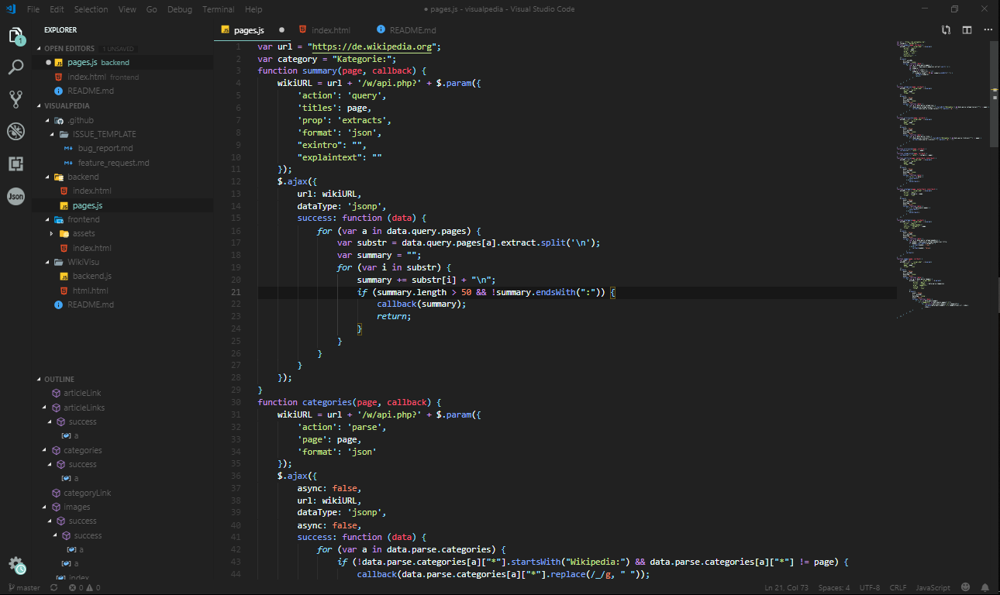
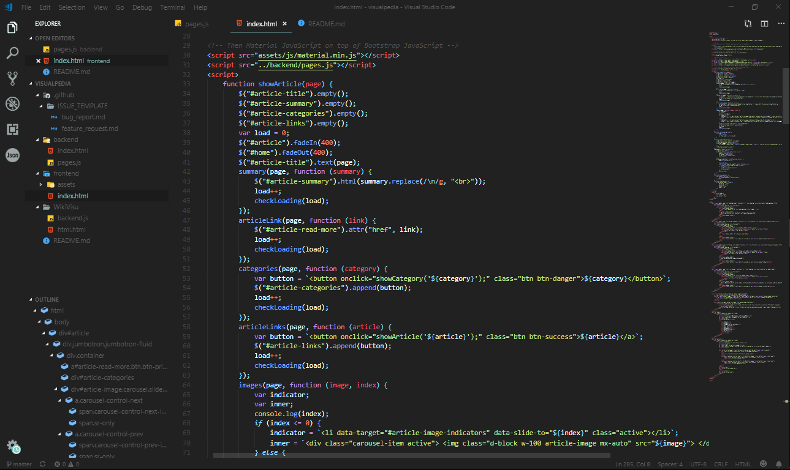

# visualpage
Customize other pages with your own touch!

To the website: [here]() 
* [Frontend](https://codedoctorde.github.io/visualpage/frontend/) 
* [Wiki](https://github.com/codedoctorde/visualpage/wiki/)

Pictures:

# License

[MIT-License](LICENSE)
